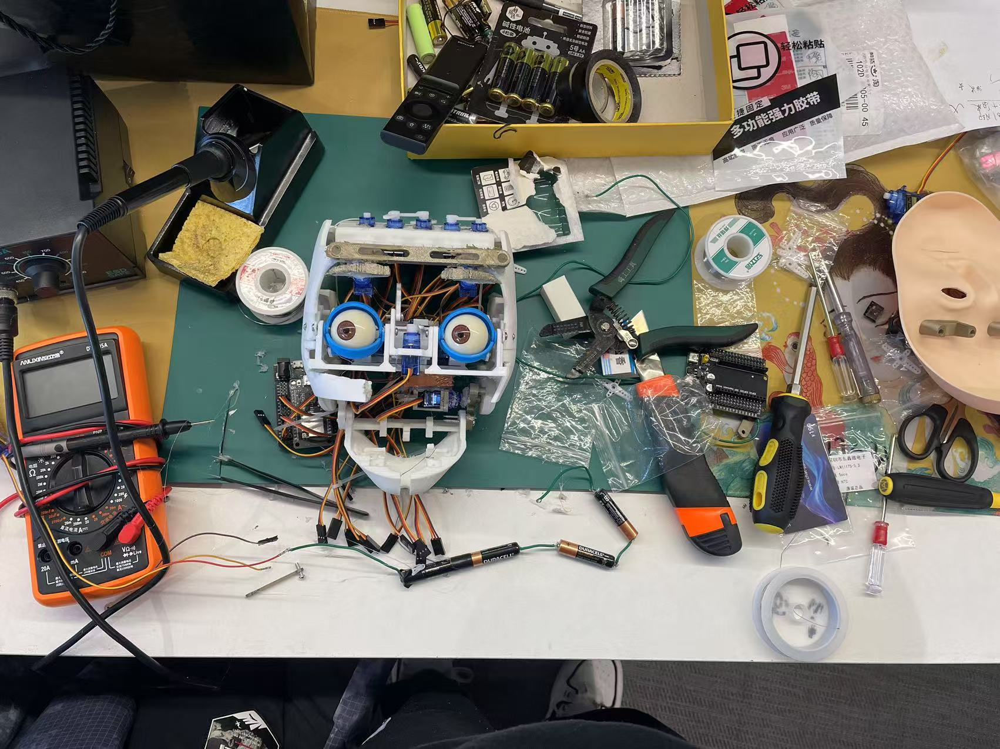

# Emotion-Based Robotic Head Control

This project demonstrates how to control a robotic head using facial emotion recognition. The system uses a client-server architecture where the client detects human emotions via a camera and sends the information to an ESP32-based robotic head, which then reacts by moving servos to express corresponding emotions.

---

## Features

- **Real-Time Emotion Recognition**: Recognizes emotions like neutral, happy, sad, angry, and surprise using a webcam.
- **ESP32-Based Control**: Communicates with an ESP32 microcontroller over a TCP socket.
- **Servo Motor Expressions**: Controls multiple servo motors to simulate facial expressions.
- **Blinking Mechanism**: Simulates natural blinking every 10 seconds.

---

## Hardware Requirements

1. **ESP32** microcontroller.
2. **Servo Motors** (11 total):
   - Eye movement (X and Y axes)
   - Eyelids
   - Eyebrows (left and right)
   - Mouth (left, right, and opening/closing)
3. **Power Supply** for ESP32 and servos.
4. **Camera** (connected to the client machine).
5. Wi-Fi network.

---

## Software Requirements

1. **Python 3.10** (specific version required)
   - Required libraries:
     - `opencv-python`
     - `fer`
2. **Arduino IDE**
   - ESP32 board package.
   - Servo library: `ESP32Servo.h`

---

## Installation and Setup

### Step 1: Clone the Repository

First, clone the repository to your local machine:

```bash
git clone https://github.com/heyangli0304/RobotFace.git
cd RobotFace
```

### Windows Setup

#### 1. Install Python 3.10

1. Download Python 3.10 from the [official Python website](https://www.python.org/downloads/release/python-3100/).
2. During installation, **ensure to check the box "Add Python to PATH"**.
3. Verify the installation by running the following command in Command Prompt:
   ```bash
   python --version
   ```
   It should return `Python 3.10.x`.

#### 2. Install Dependencies and Set Up Virtual Environment

1. Open a Command Prompt (Press `Windows + R`, type `cmd`, and hit Enter).
2. Navigate to your project folder using the `cd` command:
   ```bash
   cd path\to\Emotion-Based-Robotic-Head
   ```
3. Create a virtual environment named `RobotFace`:
   ```bash
   python -m venv RobotFace
   ```
4. Activate the virtual environment:
   ```bash
   RobotFace\Scripts\activate
   ```
   You should now see `(RobotFace)` before the command prompt, indicating the virtual environment is active.
5. Install the required libraries in the virtual environment:
   ```bash
   pip install opencv-python fer
   ```

#### 3. Run the Client Code

```bash
python client_emotion_recognition.py
```

Make sure to replace `server_ip` in the client code with the ESP32's IP address.

### Ubuntu Setup

#### 1. Install Python 3.10

1. Open a terminal window.
2. Install Python 3.10 (if not already installed):
   ```bash
   sudo apt update
   sudo apt install python3.10 python3.10-venv python3.10-dev
   ```
3. Verify the installation by running:
   ```bash
   python3.10 --version
   ```
   It should return `Python 3.10.x`.

#### 2. Install Dependencies and Set Up Virtual Environment

1. Navigate to your project folder:
   ```bash
   cd /path/to/RobotFace
   ```
2. Create a virtual environment named `RobotFace`:
   ```bash
   python3.10 -m venv RobotFace
   ```
3. Activate the virtual environment:
   ```bash
   source RobotFace/bin/activate
   ```
   You should now see `(RobotFace)` before the command prompt, indicating the virtual environment is active.
4. Install the required libraries in the virtual environment:
   ```bash
   pip install opencv-python fer
   ```

#### 3. Run the Client Code

```bash
python client_emotion_recognition.py
```

Make sure to replace `server_ip` in the client code with the ESP32's IP address.

---

### ESP32 Setup

#### 1. Install ESP32 Board Package

1. Open the Arduino IDE.
2. Go to `File > Preferences`.
3. Add the following URL to the "Additional Board Manager URLs" field:
   ```
   https://dl.espressif.com/dl/package_esp32_index.json
   ```
4. Go to `Tools > Board > Board Manager` and search for "ESP32" to install the board package.

#### 2. Upload the ESP32 Code (Server Code)

1. Connect your ESP32 to the computer.
2. Open `esp32_robot_head.ino` (this is the **server code**) in the Arduino IDE.
3. Update the Wi-Fi credentials in the code:
   ```cpp
   const char* ssid = "YOUR_WIFI_SSID";
   const char* password = "YOUR_WIFI_PASSWORD";
   ```
4. Upload the code to the ESP32.

#### 3. Connect the Servos

Connect each servo to the appropriate pin as defined in the `servoPins` array in the code. Make sure the power supply is adequate to drive all servos.

---

## Usage

1. Power on the ESP32 and ensure it connects to the Wi-Fi network.
2. Run the client code on the computer with a connected webcam:
   ```bash
   python client_emotion_recognition.py
   ```
3. The ESP32 will:
   - Move the servos to express the detected emotion.
   - Blink every 10 seconds.
4. Press `q` in the client window to terminate the program.

---

## System Overview

### Client Code (Python)

The client code, `client_emotion_recognition.py`, uses OpenCV and the FER library to:

1. Capture frames from the webcam.
2. Detect faces and recognize emotions.
3. Send emotion and face position data to the ESP32 over a TCP connection.

### ESP32 Code (Arduino)

The ESP32 code, `esp32_robot_head.ino`, serves as the server. It:

1. Receives emotion and face position data from the client.
2. Maps face position to servo angles for X and Y axes.
3. Adjusts servos to simulate the detected emotion.
4. Implements a blinking mechanism every 10 seconds.

---

## File Structure

```
RobotFace/
├── README.md                     # Project documentation
├── RobotFace.jpg                  # Demo image (Robot Face)
├── .gitattributes                 # Git configuration file
└── src/
    ├── client/
    │   └── recognize_emotion.py  # Python client code for emotion recognition
    └── server_robot_face_esp32/
        ├── face_control/         
        │   └── face_control.ino   # ESP32 code for controlling the robotic face
        ├── test_servo/            # Folder for testing servos (optional)
        └── libraries/             # Servo libraries (for ESP32)
```

---

## Emotion Mapping

| Emotion  | Servo Behavior                                     |
| -------- | -------------------------------------------------- |
| Neutral  | Eyebrows relaxed, mouth closed.                    |
| Happy    | Eyebrows slightly raised, mouth corners lifted.    |
| Sad      | Eyebrows angled down, mouth corners dropped.       |
| Angry    | Eyebrows furrowed inward, mouth corners tightened. |
| Surprise | Eyebrows fully raised, mouth opened slightly.      |

---

## Troubleshooting

### 1. No Emotion Detected

- Ensure proper lighting for the camera.
- Adjust the webcam position for clear visibility of faces.

### 2. Connection Issues

- Verify that the client and ESP32 are on the same Wi-Fi network.
- Check the `server_ip` value in the client code matches the ESP32's IP address.

### 3. Servo Not Moving

- Check the servo connections and power supply.
- Ensure the servo pins match the `servoPins` array in the ESP32 code.

---

## Future Improvements

- Add more detailed emotion mappings.
- Use additional sensors for enhanced interactivity.
- Integrate a mobile app for remote control and monitoring.

---

## License

This project is licensed under the MIT License. Feel free to use, modify, and distribute this code as needed.

---

## Acknowledgments

- [FER Library](https://github.com/justinshenk/fer) for emotion recognition.
- ESP32 and Arduino communities for providing excellent resources and support.

---

## Demo



